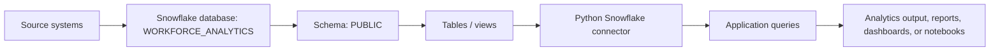
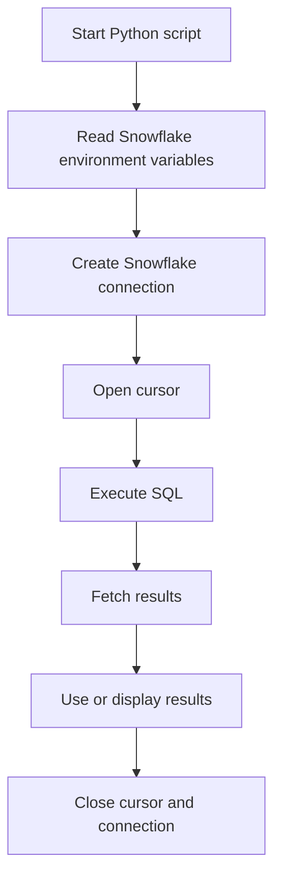
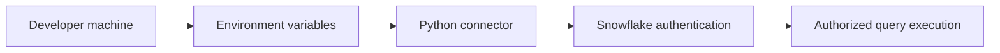

# Workforce Analytics Components and Flow

## Implemented Components

| Component | File / Location | Purpose |
| --- | --- | --- |
| Snowflake connection helper | `snowflake_connection.py` | Creates a Snowflake connection using environment variables. |
| Connection smoke test | `snowflake_connection.py` | Runs `SELECT CURRENT_VERSION()` to confirm connectivity. |
| Python dependency list | `requirements.txt` | Installs `snowflake-connector-python`. |
| Environment template | `.env.example` | Shows required Snowflake configuration keys without storing secrets. |
| Git ignore rules | `.gitignore` | Prevents `.env`, virtual environments, and Python cache files from being committed. |
| Setup instructions | `README.md` | Documents install, environment variable setup, and test command. |

## Snowflake Components

These are the Snowflake objects used by the connection configuration.

| Component | Current Value | Role |
| --- | --- | --- |
| Account | `orfaqms-gyb24946` | Snowflake account identifier. |
| User | `SMRANGARA` | Snowflake login/user identity. |
| Warehouse | `COMPUTE_WH` | Compute resource used to run SQL queries. |
| Database | `WORKFORCE_ANALYTICS` | Main analytics database. |
| Schema | `PUBLIC` | Default schema used for queries. |

Expected Workforce Analytics data objects may include tables or views such as employee, department, attendance, payroll, hiring, attrition, performance, and workforce planning datasets. To list the exact live objects, run:

```sql
SHOW TABLES IN DATABASE WORKFORCE_ANALYTICS;
SHOW VIEWS IN DATABASE WORKFORCE_ANALYTICS;
SHOW SCHEMAS IN DATABASE WORKFORCE_ANALYTICS;
```

## Data Flow



1. Workforce source data is loaded into Snowflake.
2. Snowflake stores the data in the `WORKFORCE_ANALYTICS` database.
3. The app connects to Snowflake using `snowflake-connector-python`.
4. Connection settings come from environment variables.
5. SQL queries run against the configured warehouse, database, and schema.
6. Query results can be used by an app, report, dashboard, notebook, or export process.

## App Flow



Current app flow in `snowflake_connection.py`:

1. `main()` starts the script.
2. `connect_to_snowflake()` reads:
   - `SNOWFLAKE_ACCOUNT`
   - `SNOWFLAKE_USER`
   - `SNOWFLAKE_PASSWORD`
   - `SNOWFLAKE_WAREHOUSE`
   - `SNOWFLAKE_DATABASE`
   - `SNOWFLAKE_SCHEMA`
3. The script opens a Snowflake connection.
4. It creates a cursor.
5. It executes `SELECT CURRENT_VERSION()`.
6. It prints the Snowflake version.
7. The context managers close the cursor and connection.

## Security Flow



Secrets should stay outside source code. The repo intentionally uses `.env.example` as a template and ignores real `.env` files.

## Recommended Next Components

| Component | Purpose |
| --- | --- |
| `queries/` folder | Store reusable SQL files for workforce metrics. |
| `src/` package | Move connection and query logic into importable modules. |
| Dashboard layer | Streamlit, Flask, FastAPI, Power BI, Tableau, or another UI/reporting tool. |
| Data dictionary | Document tables, columns, metric definitions, and business owners. |
| Validation checks | Confirm row counts, null checks, freshness, and duplicate detection. |
| Role-based access | Use Snowflake roles instead of relying only on user-level access. |

